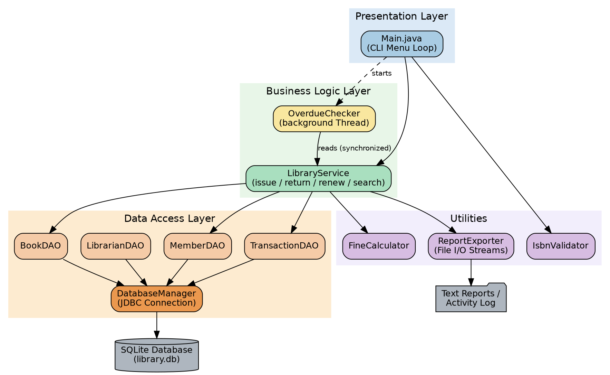
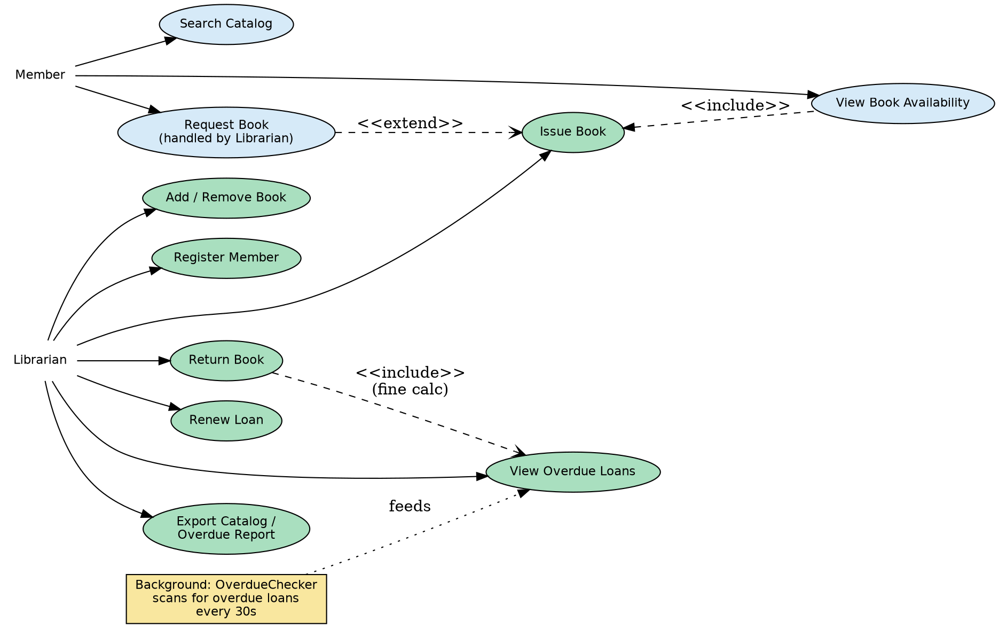
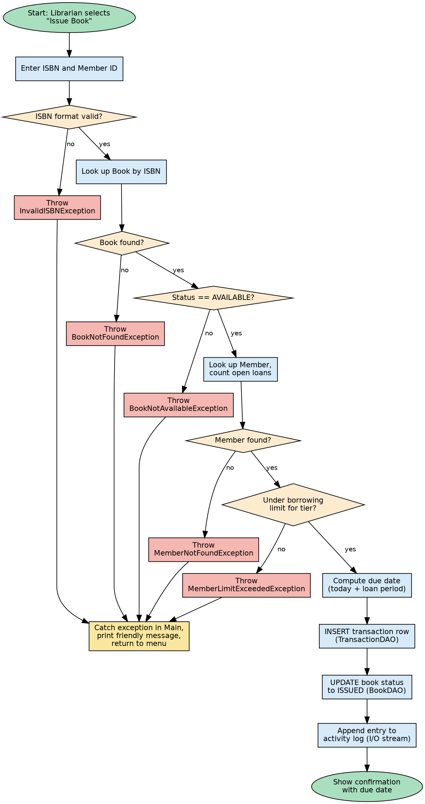
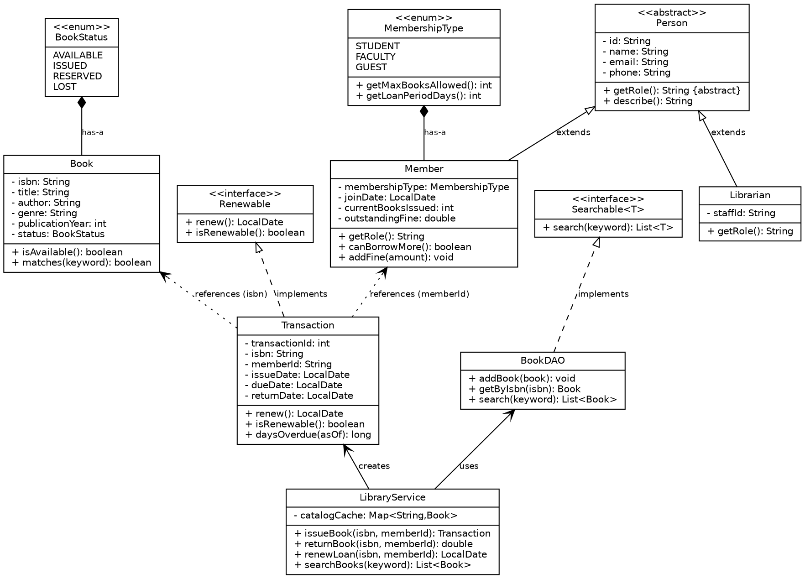
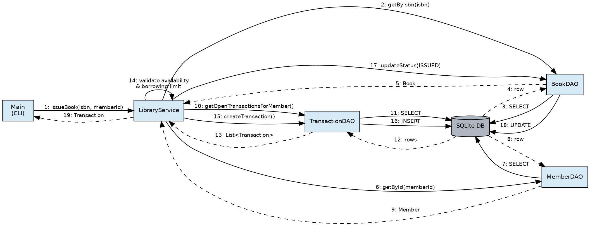
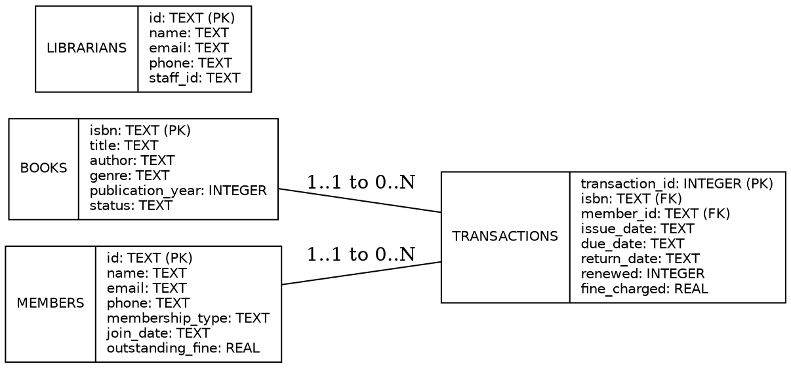

# Library Management System
### Project Report

**Student:** Aryan
**Program:** B.Tech Artificial Intelligence, VIT Bhopal
**Submission Date:** September 2026

---

## 1. Introduction

This project applies core Java concepts — fundamentals and flow control, object-oriented
programming, exception handling, multithreading, the Collections framework,
Java I/O streams, and JDBC-based database access.

This report documents a **Library Management System**: a command-line Java
application that lets a librarian manage a book catalog, register members,
issue/return/renew loans, automatically calculate overdue fines, and export
reports — all backed by a persistent SQLite database accessed through JDBC.

The project was deliberately scoped so that nearly every syllabus unit shows
up somewhere in the working system, rather than being demonstrated in
isolated toy snippets.

## 2. Problem Statement

College and community libraries that still rely on paper registers or bare
spreadsheets run into the same recurring problems: it is hard to tell at a
glance which copies are currently out, members lose track of due dates,
overdue fines get calculated inconsistently (or not at all), and there is no
searchable record of who borrowed what and when.

This project addresses that gap with a lightweight, terminal-based system
that gives a librarian one consistent place to manage the catalog, member
records, and the full lending lifecycle, with fines calculated automatically
and a background process that keeps overdue tracking current even between
manual checks.

## 3. Functional Requirements

The system implements three major functional modules, each with a clear
input/output structure and a logical CLI workflow:

1. **Catalog Management** — add, remove, list, and keyword-search books by
   title, author, genre, or ISBN.
2. **Member Management** — register members under STUDENT, FACULTY, or GUEST
   tiers (each with its own borrowing limit and loan period), list and search
   members, and track each member's live loan count and outstanding fines.
3. **Lending Workflow (Issue / Return / Renew)** — issue a book to a member
   with full rule validation, return a book with automatic fine calculation,
   and renew an open loan once if it is not already overdue.

Supporting functionality:

- **Reporting** — export the full catalog or the current overdue list to a
  timestamped `.txt` file, and maintain a running plain-text activity log.
- **Background overdue monitoring** — a daemon thread periodically scans for
  overdue loans independent of the main CLI loop.

## 4. Non-Functional Requirements

| Requirement | How it is addressed |
|---|---|
| **Performance** | Frequently-read book data is cached in a `HashMap` in the service layer; SQLite queries use indexed primary-key lookups. |
| **Reliability** | Every database write goes through parameterised `PreparedStatement`s inside try-with-resources blocks, so connections and statements are always released, even on error. |
| **Security** | All SQL is parameterised (no string-concatenated queries), which rules out SQL injection from user input. |
| **Usability** | A numbered menu with plain-English prompts means the librarian never needs to memorise commands or flags. |
| **Maintainability** | Strict layering (`model` / `dao` / `service` / `ui` / `thread` / `util`) keeps persistence, business rules, and presentation independent, so any one layer can change without touching the others. |
| **Error-handling strategy** | A hierarchy of custom checked exceptions (`LibraryException` and its subclasses) represents business-rule failures distinctly from unchecked input errors (`InvalidISBNException`) and from low-level `SQLException`/`IOException`, each caught and reported separately in `Main`. |
| **Logging / monitoring** | Every issue, return, renewal, and overdue detection is appended to `reports/activity.log` with a timestamp. |
| **Resource efficiency** | A single shared JDBC connection is reused for the life of the application instead of opening a new connection per query. |

## 5. System Architecture

The system follows a classic layered architecture: a presentation layer (the
CLI), a business-logic layer (`LibraryService` plus the background
`OverdueChecker` thread), a data-access layer (one DAO class per entity, all
routed through a single `DatabaseManager`), and a small utilities layer for
fine calculation, ISBN validation, and file-based report export.



**Layer responsibilities:**

- **Presentation (`ui.Main`)** — renders the menu, reads input, calls the
  service layer, and is the only place exceptions are caught and translated
  into user-facing messages.
- **Business Logic (`service.LibraryService`, `thread.OverdueChecker`)** —
  owns every business rule (availability checks, borrowing limits, fine
  calculation, renewal eligibility) so the rule lives in exactly one place.
- **Data Access (`dao.*`)** — translates between Java objects and SQL rows;
  no business logic lives here.
- **Utilities (`util.*`)** — small, stateless, easily unit-testable helpers.

## 6. Design Diagrams

### 6.1 Use Case Diagram



Two actors interact with the system: **Member** (indirectly, through the
librarian, since the CLI is currently single-operator) and **Librarian**
(directly). The diagram also shows the background `OverdueChecker` feeding
the "View Overdue Loans" use case independently of any manual action.

### 6.2 Workflow Diagram — "Issue Book"



This flowchart traces the exact validation order implemented in
`LibraryService.issueBook()`: ISBN format, book existence, availability,
member existence, and borrowing limit — each guarded by a distinct custom
exception.

### 6.3 Class / Component Diagram



Key relationships shown:

- `Member` and `Librarian` both extend the abstract class `Person`.
- `Transaction` implements the `Renewable` interface.
- `BookDAO` and `MemberDAO` implement the generic `Searchable<T>` interface.
- `LibraryService` composes the DAOs and creates `Transaction` objects — it
  does not extend them, keeping composition preferred over inheritance where
  there is no "is-a" relationship.

### 6.4 Sequence Diagram — "Issue Book"



Traces the full call path for `issueBook()`: from the CLI, through
`LibraryService`'s validation calls to `BookDAO` and `MemberDAO`, to the
`INSERT` via `TransactionDAO` and the final status `UPDATE` via `BookDAO`.

### 6.5 ER Diagram



Four tables: `books`, `members`, `librarians`, and `transactions`. Both
`books` and `members` have a 1-to-many relationship with `transactions`
(one book or member can appear in many loan records over time), enforced
with foreign keys.

## 7. Design Decisions & Rationale

- **SQLite over a client-server database.** The project needs real,
  persistent, queryable storage without asking the evaluator to install and
  configure a separate database server. SQLite's embedded, file-based model
  satisfies the JDBC requirement (Unit 5) with zero external setup.
- **Abstract `Person` base class.** `Member` and `Librarian` share every
  field (id, name, email, phone) but differ in role-specific behaviour and
  privileges. An abstract base with an abstract `getRole()` method gives real
  runtime polymorphism instead of a single flat class with an unused "type"
  flag.
- **Checked vs. unchecked exceptions.** Business-rule violations that a
  caller is expected to recover from (book unavailable, member not found) are
  modelled as checked exceptions extending `LibraryException`, forcing every
  call site to handle them explicitly. `InvalidISBNException` is unchecked
  because it represents a programmer/input error that should be validated
  eagerly at the point of input, not threaded through every method signature.
- **Extending `Thread` for `OverdueChecker`.** The syllabus experiment list
  specifically calls out "implement multithreading by extending Thread
  class," so `OverdueChecker` does exactly that rather than implementing
  `Runnable` directly. It is marked as a daemon thread so it never prevents
  the JVM from exiting when the librarian chooses to quit.
- **`synchronized` on `issueBook`/`returnBook`/`renewLoan`.** Because the
  background thread reads loan state concurrently with the main thread's
  writes, these three methods are synchronized on the shared
  `LibraryService` instance to prevent a lost-update race between "check
  availability" and "mark issued."
- **A small `HashMap` cache in `LibraryService`.** Deliberately included, on
  top of the `ArrayList`s already used inside the DAOs, so the Collections
  framework (Unit 4) is used for more than one data structure and for a
  genuine purpose (avoiding a repeated database round-trip for the same
  ISBN) rather than being bolted on.

## 8. Implementation Details

The project is a standard Maven build (`pom.xml`) targeting Java 17, with two
dependencies: `org.xerial:sqlite-jdbc` for persistence and JUnit 5 for
testing. It compiles to 20 main-source files plus 3 test files, organised
into six packages:

| Package | Contents |
|---|---|
| `model` | `Person` (abstract), `Member`, `Librarian`, `Book`, `Transaction`, `BookStatus` (enum), `MembershipType` (enum with constructor), `Searchable<T>` and `Renewable` (interfaces) |
| `exception` | `LibraryException` (base checked exception) and five subclasses/siblings: `BookNotAvailableException`, `BookNotFoundException`, `MemberNotFoundException`, `MemberLimitExceededException`, `InvalidISBNException` |
| `dao` | `DatabaseManager`, `BookDAO`, `MemberDAO`, `LibrarianDAO`, `TransactionDAO` |
| `service` | `LibraryService` |
| `thread` | `OverdueChecker` |
| `util` | `FineCalculator`, `IsbnValidator`, `ReportExporter` |
| `ui` | `Main` |

**Notable implementation points:**

- All JDBC access uses `PreparedStatement` with `?` placeholders — never
  string-concatenated SQL — including for the generated-key retrieval used
  when a new loan is created.
- `DatabaseManager.initializeSchema()` uses `CREATE TABLE IF NOT EXISTS`, so
  the app is safe to run repeatedly against the same database file without
  a separate migration step.
- Fine calculation is isolated in `FineCalculator` (a stateless utility) so
  the formula (₹5/day after a 1-day grace period) is defined exactly once and
  is trivially unit-testable.
- Reports and the activity log are written with `BufferedWriter`/`FileWriter`
  inside try-with-resources blocks, demonstrating Unit 4's character-stream
  I/O rather than reaching for a third-party logging library.

## 9. Screenshots / Results

Sample terminal session — adding two books, registering a member, issuing and
returning a book, and exporting a catalog report:

```
=================================================
 LIBRARY MANAGEMENT SYSTEM
=================================================

---------------- MAIN MENU ----------------
 1. Add Book
 2. View All Books
 ...
 0. Exit
Enter your choice: 1
ISBN (10 or 13 digits): 9780132350884
Title: Clean Code
Author: Robert C. Martin
Genre: Software Engineering
Publication year: 2008
Book added successfully.

Enter your choice: 2
9780132350884 | Clean Code    | Robert C. Martin | Software Engineering | 2008 | Available
9780134685991 | Effective Java| Joshua Bloch     | Programming           | 2018 | Available

Enter your choice: 7
ISBN: 9780132350884
Member ID: M001
Book issued. Txn#1 | ISBN:9780132350884 | Member:M001 | Issued:2026-09-12 | Due:2026-09-26 | OPEN

Enter your choice: 8
ISBN: 9780132350884
Member ID: M001
Book returned on time. No fine.

Enter your choice: 12
Catalog report written to: reports/catalog_2026-09-12_04-09-11.txt

Enter your choice: 0
Shutting down background threads...
Goodbye!
```

Corresponding exported catalog report (`reports/catalog_2026-09-12_04-09-11.txt`):

```
LIBRARY CATALOG REPORT
Generated: 2026-09-12T04:09:11.190285710
====================================================================================================
9780132350884 | Clean Code                     | Robert C. Martin     | Software Engineering | 2008 | Available
9780134685991 | Effective Java                 | Joshua Bloch         | Programming     | 2018 | Available
====================================================================================================
Total books: 2
```

Corresponding activity log entries (`reports/activity.log`), written by the
service layer and the background thread:

```
[2026-09-12T04:09:11.177789589] ISSUED book 9780132350884 to member M001, due 2026-09-26
[2026-09-12T04:09:11.188307314] RETURNED book 9780132350884 from member M001, on time
[2026-09-12T04:09:11.197121447] OverdueChecker thread stopped.
```

## 10. Testing Approach

Testing was done at two levels:

**Unit tests (JUnit 5, `src/test/java`)** cover pure logic that does not
depend on the database, so it can be tested in isolation and run with
`mvn test`:

- `FineCalculatorTest` — no fine within the grace period, correct per-day
  accrual afterward, and never a negative fine.
- `IsbnValidatorTest` — accepts valid 10- and 13-digit ISBNs (with or without
  hyphens), rejects wrong lengths and non-numeric input.
- `TransactionRenewalTest` — an open, not-yet-due loan is renewable exactly
  once; an already-overdue loan is not renewable and throws
  `IllegalStateException` if renewal is attempted anyway.

All of this logic was additionally verified by direct execution before being
committed, confirming 14/14 assertions pass.

**Manual/functional testing** exercised the full CLI against a real SQLite
database: adding books and members, issuing a book (including the negative
cases — issuing an already-issued book, issuing to a member at their
borrowing limit, issuing with a malformed ISBN), returning on time and late
(to confirm fine calculation), renewing a loan, and exporting both report
types. Each negative case was confirmed to raise the correct custom exception
and print a friendly message rather than a stack trace.

## 11. Challenges Faced

- **Deriving "books currently issued" without denormalising the data.**
  Rather than storing a running count on the `members` table (which risks
  drifting out of sync with the actual transaction rows), the count is
  computed on demand from open transactions. This keeps a single source of
  truth at the cost of one extra query per lookup — an acceptable trade-off
  at this scale.
- **Keeping the background thread safe.** Since `OverdueChecker` reads loan
  data on its own schedule while the main thread may simultaneously be
  issuing or returning a book, the relevant `LibraryService` methods needed
  to be `synchronized` to avoid a race between checking a book's availability
  and updating its status.
- **Deciding the exception hierarchy.** Early drafts caught every failure as
  a generic `Exception`, which produced unhelpful "something went wrong"
  messages. Splitting failures into a checked `LibraryException` family
  (business rules) versus an unchecked `InvalidISBNException` (input
  validation) made the `catch` blocks in `Main` both more precise and easier
  to read.

## 12. Learnings & Key Takeaways

- Designing a small exception hierarchy up front made the CLI's error
  handling dramatically cleaner than catching one broad `Exception` type,
  and mirrors how real-world Java codebases separate recoverable business
  errors from programmer errors.
- Introducing even one background thread forces you to think carefully about
  which methods can be called concurrently — `synchronized` was necessary in
  exactly the two or three places where reads and writes could actually
  interleave, not everywhere.
- Keeping the DAO layer strictly about SQL (no business rules) made the
  `LibraryService` class the single place to look when checking or changing
  a business rule, which paid off repeatedly while iterating on the
  borrowing-limit and fine logic.

## 13. Future Enhancements

- A reservation queue so a member can reserve a currently-issued book.
- Per-member login/authentication so members can query their own loans and
  fines directly instead of going through library staff.
- Migrating the JDBC layer to JPA/Hibernate entities (a natural next step
  given Unit 5 also covers JPA) to reduce the boilerplate in the DAO classes.
- A simple REST API wrapper around `LibraryService` so the same business
  logic could back a future web or mobile client without being rewritten.

## 14. References

1. Herbert Schildt, *Java: The Complete Reference*, 11th Edition, Oracle
   Press, 2018.
2. Oracle Java SE 17 Documentation — <https://docs.oracle.com/en/java/javase/17/>
3. SQLite JDBC Driver (xerial/sqlite-jdbc) —
   <https://github.com/xerial/sqlite-jdbc>
